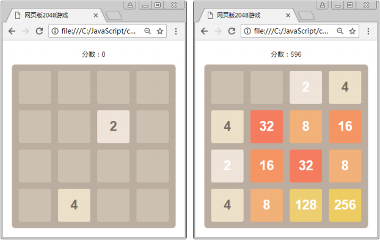
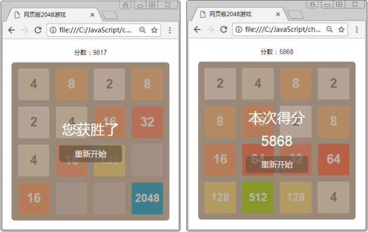

#2048游戏分析

## 学习目标

- 掌握DOM，能够对元素进行操作
- 掌握事件处理，完成不同功能的开发
- 掌握动画特效，改善游戏的体验度

​        2048 是一款比较流行的数字游戏，它是 Gabriele Cirulli 为了好玩，根据已有的数字游戏玩法开发而成的一款新的数字游戏，并将其开源版本放到 Github 上后意外走红。随后 2048 出现了各种衍生版，如 2048 六边形、挑战 2048、汉服 2048 等。
​        接下来，在全面学习了 JavaScript 和 jQuery 以后，请利用 DOM 操作、动画特效、键盘事件、鼠标事件等结合 HTML 与 CSS 实现网页版的 2048 小游戏。

## 游戏功能演示

​	网页版的 2048 玩法是，通过键盘的方向键，上（↑）、下（↓）、左（←）、右（→）控制数字的移动。每移动一次，所有的数字方块都会往移动的方向靠拢，然后系统会在空白的地方随机出现一个数字（2 或 4）方块，相同数字的方块在移动的过程中会叠加，通过不断叠加，最终拼凑出 2048 这个数字就算成功。效果如图 12-1 和图 12-2 所示。

## 实现步骤分析

在实现网页版 2048 小游戏之前，我们首先需要对此游戏进行全方位的分析，然后才能有条理的完成相关功能的实现。一个完整的游戏大体上是由游戏的界面及游戏规则构成。下面将分别从以上的两个方面对网页版 2048 小游戏（以下都简称 2048）进行分析。

### 游戏界面构成

- 2048 游戏页面是由标题、分数和游戏操作区组成。
- 游戏操作区是由 4×4 的棋盘格子和数字格组成。
- 数字格是由数字和背景色组成。
- 数字的颜色有黑色和白色。
- 数字格的背景色，根据数字值的不同而不同。
- 游戏结束时的页面由提示信息（文字和分数）和“重新开始”按钮组成。

### 游戏规则

- 游戏操作键为：上（↑）、下（↓）、左（←）、右（→）。
-  数字格子移动的条件是，当操作方向的其他格子是空或相邻两个格子的数值相同时才可以移动。
- 值相同的数字格子叠加后，在分数区域显示对应的分值（相同数值的累加值）。
- 当玩家成功叠加出 2048 的数字格子后，游戏就算顺利通关了。
- 当数字填满所有格子，并且相邻的格子也无法移动的话，游戏结束。

  ​从上面的分析可以知道，在实现游戏功能时，可通过 HTML 和 CSS 完成游戏界面的设计，通过JavaScript 和 jQuery 按照游戏的规则完成相应功能的实现，之后玩家就可以在网页中按照我们设定的规则操作 2048 游戏。