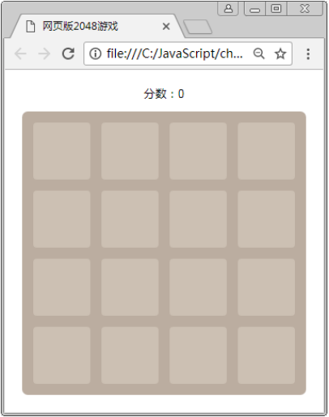

#设计游戏界面

## 构建网页游戏布局

​	编写 index.html 文件，在文件中完成 2048 游戏的页面布局，具体代码如下。

```html
<!DOCTYPE html>
<html>
  <head>
    <meta charset="UTF-8">
    <title>网页版2048游戏</title>
    <style>/*具体样式参考源代码*/</style>
  </head>
  <body>
    <div id="game" class="game">
      <div class="game-score">分数：<span id="game_score">0</span></div>
      <div id="game_container" class="game-container">
      </div>
    </div>
    <script src="js/jquery-1.12.4.min.js"></script>
  </body>
</html>
```

​	在上述代码中，第 10 行 id 为 game_score 的<span>元素用于显示分数；第 11 行 id 为 game_container的<div>元素用于显示数字方块，这些方块将会由 JavaScript 自动生成。

​	接着在第 13 行代码的下面添加以下代码，利用 JavaScript 封装一个 Game2048 函数。

```html
<script src="js/Game2048.js"></script>
<script>
  Game2048({prefix: 'game', len: 4, size: 100, margin: 20});
</script>
```

​	上述代码在调用 Game2048()函数时，传递了对象形式的参数。其中，prefix 表示网页中的 id 前缀，用来限制函数内部的代码只对指定 id 前缀的元素进行操作；len 表示棋盘格的单边单元格数量，由于棋盘格是正方形，因此设为 4 就表示 4×4 的单元格布局；size 表示每个单元格的单边长度（像素），设为 100 则单元格大小为100px×100px；margin 表示单元格间距（像素），设为 20 则每个单元格之间的距离为 20px。

## 初始化游戏界面

编写 Game2048.js 文件，用于保存与游戏相关的代码，具体代码如下。

```javascript
(function(window, document, $) {
	function Game2048(opt) {
		var prefix = opt.prefix, len = opt.len, size = opt.size, margin = opt.margin;
		var view = new View(prefix, len, size, margin);
	}
	window['Game2048'] = Game2048;
})(window, document, jQuery);
```

​	上述代码是一个自调用函数，第 7 行在调用函数时传入了 window、document 和 jQuery 参数，表示该函数依赖这些全局变量；第 3 行代码从 opt 对象参数中取出成员，并保存为对应名称的变量；第 4 行代码创建了 view 对象，该对象将用于处理游戏的页面效果。

​	接下来编写 View 构造函数，在构造函数中设置棋盘背景的宽度和高度，具体代码如下。

```javascript
function View(prefix, len, size, margin) {
	this.prefix = prefix;	// id 或 class 前缀
	this.len = len;	// 棋盘单边单元格数量（总数量为 len * len）
	this.size = size;	// 单元格边长，单元格大小为 size×size
	this.margin = margin;	// 单元格间距
	this.container = $('#' + prefix + '_container');
	var containerSize = len * size + margin * (len + 1);
	this.container.css({width: containerSize , height: containerSize});
	this.nums = {};	// 保存所有数字单元格对象
}
```

​	在上述代码中，第 6 行用于获取页面中 id 为 game_container 的<div>元素，然后通过第 7~8 行代码设置该元素的宽和高。其中，第 7 行代码用来计算边长，即通过“len * size”得到单元格总边长，再用“margin* (len + 1)”得到间距的总边长，两者加起来就是棋盘的边长。

 ## 自动生成空棋盘格

​	完成棋盘设置后，下面在棋盘中绘制空单元格形成棋盘格子。首先通过 JavaScript 在 game_container容器中自动生成如下形式的 game-cell 元素，来表示每个单元格。

```html
<div class="game-cell" style="width: 100px; height: 100px; top: 20px;left: 20px"></div>
```

​	在生成结果中，width 和 height 表示单元格的宽和高，top 和 left 用于定位单元格的位置。需要注意的是，为了使定位生效，需要将容器 game_container 的 position 样式设为 relative，并将单元格的 position 样式设为absolute，让单元格相对于容器来定位。

​	设置定位后，单元格的 top 值就表示距离容器顶部多少像素，left 值表示距离容器左边多少像素。其计算公式为“margin + n * (size + margin)”，n 表示当前单元格前共有多少个单元格，margin 表示间距，size表示单元格边长。例如，横向第 2 个单元格的 left 值为 20 + 1* (100 + 20) = 140px。

​	接下来继续编写 View 对象，实现自动生成空棋盘格，具体代码如下。

```javascript
View.prototype = {
  // 计算位置
  getPos: function(n) {
    return this.margin + n * (this.size + this.margin);
  },
  init: function() {
    for (var x = 0, len = this.len; x < len; ++x) {
      for (var y = 0; y < len; ++y) {
        var $cell = $('<div class="' + this.prefix + '-cell"></div>');
        $cell.css({
            width: this.size + 'px', height: this.size + 'px', 
            top: this.getPos(x), left: this.getPos(y)
        }).appendTo(this.container);
      }
    }
  }
};
```

​	从上述代码可以看出，init()方法用于根据 len（棋盘单边单元格数量）自动生成空单元格，生成后将会添加到game_container 容器中。第 10~11 行代码用于指定空单元格的样式，其 top 与 left 通过 getPos()方法进行计算。

​	为了测试程序是否能够正常运行，在 Game2028 函数中调用 init()方法，如下所示。

```javascript
view.init();
```

​	通过浏览器访问，运行结果如图所示。

