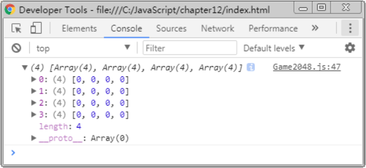
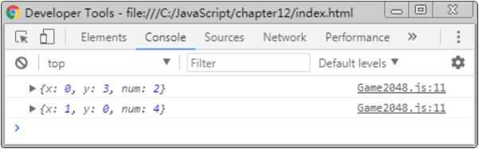
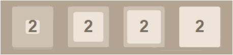
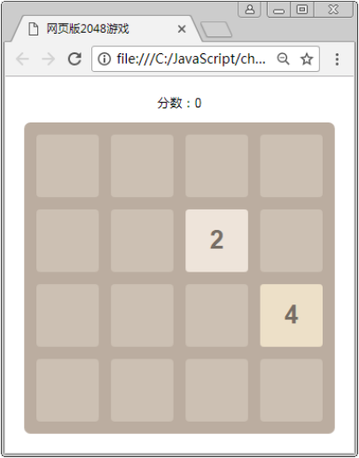

#控制游戏数值

## 创建棋盘数组

​	创建二维数组，用于保存棋盘中的数值，外层数组表示行，内层数组表示列。在保存时，如果单元格为空，则数组元素对应的值为 0。

​	为了使代码更好维护，下面将通过 Board 构造函数专门处理单元格中的数值，具体代码如下。

```javascript
function Board(len) {
  this.len = len;
  this.arr = [];
}
Board.prototype = {
  init: function() {
    for (var arr = [], x = 0, len = this.len; x < len; ++x) {
      arr[x] = [];
      for (var y = 0; y < len; ++y) {
          arr[x][y] = 0;
        }
    }
    this.arr = arr;
  }
};
```

​	在上述代码中，init()方法用于根据指定 len 创建二维数组，在初始情况下所有的单元格都是空的，因此第 8 行代码为每个单元格赋值为 0。

​	接下来在 Game2048 函数中测试程序，具体代码如下。

```javascript
var board = new Board(len);
board.init();
console.log(board.arr);
```

​	在控制台中查看自动生成的二维数组，如图所示。



## 为棋盘生成随机数字单元格

​	在 2048 游戏开始时，会在棋盘格中的随机位置生成两个随机数字（2 或 4）。下面编写代码，为 Board原型对象增加方法，用于生成随机数字单元格，具体代码如下。

```javascript
// 在随机位置增加一个随机数
generate: function() {
  var empty = [];
  for (var x = 0, arr = this.arr, len = arr.length; x < len; ++x) {
    for (var y = 0; y < len; ++y) {
      if (arr[x][y] === 0) {
        empty.push({x: x, y: y});
      }
    }
  }
  if (empty.length < 1) {
    return false;
  }
  var pos = empty[Math.floor((Math.random() * empty.length))];
  this.arr[pos.x][pos.y] = Math.random() < 0.5 ? 2 : 4;
  this.onGenerate({x: pos.x, y: pos.y, num: this.arr[pos.x][pos.y]});
},
// 每当 generate()方法被调用时，执行此方法
onGenerate: function() {},
```

​	在上述代码中，第 5~11 行用于获取 this.arr 数组中所有空单元格的下标并保存到 empty 数组中，第 15行代码随机选取 empty 中的一个空单元格，第 16 行代码随机生成一个 2 或 4，第 17 行将数字填入到单元格中。

​	由于 Board 只用于处理数据，而 View 用于处理页面，为了让两个对象联动，第 17 行通过调用事件方法this.onGenerate()触发事件，将新创建的单元格在二维数组中的位置和数字内容传递过去。

​	接下来，在 Game2048 函数中测试程序，生成 2 个随机数。具体代码如下。

```javascript
board.onGenerate = function(e) {
	console.log(e);
};
board.generate();
board.generate();
```

​	在控制台中输出的结果如图所示。



​	从图中可以看出，新生成的两个单元格的数字分别是 2 和 4，单元格 2 在数组中的位置为\[0][3]， 单元格 4 在数组中的位置为\[1][0]。

 ## 在页面中显示数字单元格

​	为 View 原型对象增加 addNum()方法，根据 x、y 和 num 显示数字单元格，具体代码如下。

```javascript
addNum: function(x, y, num) {
  var $num = $('<div class="' + this.prefix + '-num ' + this.prefix + '-num-' + num + ' ">');
  $num.text(num).css({
    top: this.getPos(x) + parseInt(this.size / 2),
    left: this.getPos(y) + parseInt(this.size / 2)
  }).appendTo(this.container).animate({
    width: this.size + 'px',
    height: this.size + 'px',
    lineHeight: this.size + 'px',
    top: this.getPos(x),
    left: this.getPos(y)
  }, 100);
  this.nums[x + '-' + y] = $num;
},
```

​	在上述代码中，第 2~3 行创建的<div>元素表示数字单元格，其生成结果示例如下。

```html
<div class="game-num game-num-2"></div>
```

​	在生成结果中，class 为 game-num-2 表示这个单元格按照数字 2 的样式显示。在游戏操作区中，为了明显区分某个数值的单元格，将根据不同的数值设置不同的背景色和文字颜色。CSS 样式示例如下。

```css
.game-num{width:0px;height:0px;border-radius:6px;font-weight:bold;font-size:40px;color:#fff;text-align:center;position:absolute;}
.game-num-2{background:#eee4da;color:#776e65;}
.game-num-4{background:#ede0c8;color:#776e65;}
.game-num-8{background:#f2b179;}
.game-num-16{background:#f59563;}
.game-num-32{background:#f67c5f;}
.game-num-64{background:#f65e3b;}
.game-num-128{background:#edcf72;font-size:35px;}
.game-num-256{background:#edcc61;font-size:35px;}
.game-num-512{background:#9c0;font-size:35px;}
.game-num-1024{background:#33b5e5;font-size:30px;}
.game-num-2048{background:#09c;font-size:30px;}
```

​	在上述代码中，第 1 行将 game-num 的宽和高设为 0，用于在数字单元格显示时以“展开”的动画效果出现。为了实现这个效果，通过 addNum()方法的第 5~6 行代码，将单元格的 top 和 left 设置为一个单元格的中心位置，然后在第 8~10 行代码中以动画形式过渡为最终样式。其动画效果如图所示。



​	addNum()方法的第 12 行代码用于将新生成的数字单元格保存到 this.nums 中，保存的属性名为单元格在 board.arr 数组中的下标位置。保存后，在进行单元格移动操作时会用到这些对象。

​	接下来在 Game2048 函数中测试 view.addNum()，具体代码如下。 

```javascript
board.onGenerate = function(e) {
	view.addNum(e.x, e.y, e.num);// 替换原来的“console.log(e);”
};
```

​	通过浏览器访问测试，运行结果如图所示。

