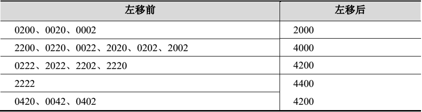
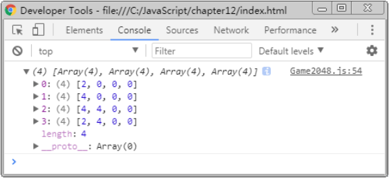

#实现单元格移动

## 单元格左移

​	2028 游戏支持使用键盘对单元格进行上移、下移、左移、右移操作。下面以左移操作为例，选取棋盘格中的某一行，分析游戏的移动规则，如表所示。



​	从表中可以看出，对单元格进行左移后，一行中所有的数字将移动到左边。如果相邻的两个数字（包括中间有空单元格的情况）相等，则进行合并。对于 2222 这种情况，其合并过程为 2222→4022→4202→4400，已经合并过的单元格不会再次合并，因此结果不是 8000。对于 2000、4200 等情况，由于数字已经在左边，且相邻数字无法累加，因此将无法左移。

​	在分析了左移的规则后，接下来在 Board 原型对象中新增 moveLeft()方法，对二维数组中的数字进行左移操作，具体代码如下。

```javascript
// 左移
moveLeft: function() {
  var canMove = false;
  // 从上到下，从左到右
  for (var x = 0, len = this.arr.length; x < len; ++x) {
    for (var y = 0, arr = this.arr[x]; y < len; ++y) {
      // 从 y + 1 位置开始，向右查找
      for (var next = y + 1; next < len; ++next) {
        // 如果 next 单元格是 0，找下一个不是 0 的单元格
        if (arr[next] === 0) {
          continue;
        }
        // 如果 y 数字是 0，则将 next 移动到 y 位置，然后将 y 减 1 重新查找
        if (arr[y] === 0) {
          arr[y] = arr[next];
          this.onMove({from: {x: x, y: next, num: arr[next]}, to: {x: x, y: y, num: arr[y]}});
          arr[next] = 0;
          canMove = true;
          --y;
        // 如果 y 与 next 单元格数字相等，则将 next 移动并合并给 y
        } else if (arr[y] === arr[next]) {
          arr[y] += arr[next];
          this.onMove({from: {x: x, y: next, num: arr[next]}, to: {x: x, y: y, num: arr[y]}});
          arr[next] = 0;
          canMove = true;
        }
        break;
      }
    }
  }
  this.onMoveComplete({moved: canMove});
},
onMove: function() {},
onMoveComplete: function() {},
```

​	为了更好的理解上述代码，下面对其实现原理进行分析，具体如下。

​	①  遍历数组，外层循环从上到下遍历数组行，内层循环从左到右遍历数组列。

​	②  在遍历到第 1 行第 1 列时，向右依次查找 1 个非 0 单元格，如果找不到，则跳转到第⑤步。

​	③  判断第 1 列是否为 0，如果是，将找到的非 0 单元格移动到第 1 列，然后重复第②步。

​	④  判断第 1 列与找到的非 0 单元格数字是否相等，如果相等，则将第 1 列数字乘以 2，然后将找到的非 0 单元格数字置为 0，实现左移合并的效果。

​	⑤  第 1 列的操作结束，进入第 2 列的操作，类似于第②步。

​	在代码中，第 15 和 23 行调用了 onMove()方法，该方法表示每次单元格移动时触发的事件，其参数是一个对象，from 保存被移动的单元格的 x、y 位置和数字，to 保存目标单元格的 x、y 位置和数字。

​	第 32 行调用了 onMoveComplete()方法，该方法表示在整个左移操作完成后触发的事件。其参数是一个对象，moved 表示本次操作是否发生过单元格移动。在 2048 游戏中，如果发生过单元格移动，则会在棋盘中自动增加一个新的随机数字单元格，为了实现这个效果，就需要用到这里的 onMoveComplete()方法和变量 moved 保存的结果。

​	接下来在 Game2048 函数中测试程序，具体代码如下。

```javascript
// 为了测试程序，临时更改 board.arr 的值
board.arr = [
	[0, 0, 0, 2], [0, 2, 0, 2], [2, 2, 2, 2], [0, 2, 4, 0],
];
board.moveLeft();
console.log(board.arr);
```

​	在控制台中输出的结果如图所示。



​	从运行结果可以看出，左移操作已经正确移动完成。需要注意的是，测试成功后，应及时删除测试代码，以避免影响后面的开发工作。

​	由于 2048 游戏的右移、上移、下移操作与左移的实现原理是一样的，这里不再进行代码演示，可参考 moveLeft()方法完成 moveRight()、moveUp()、moveDown()方法的编写。最终代码可参考本书的配套源代码。

## 以动画效果移动单元格

​	在 board 对象中已经提供了 onMove()和 onMoveComplete()事件方法与页面进行联动，下面在 Game2048函数中编写以下代码，在单元格移动后执行一些相关操作。

```javascript
board.onMove = function(e) {
  view.move(e.from, e.to);
};
board.onMoveComplete = function(e) {
  if (e.moved) {
    setTimeout(function(){ board.generate(); }, 200);
  }
};
```

​	为 View 原型对象新增 move()方法，对 this.nums 对象中保存的单元格进行处理。具体代码如下。

```javascript
move: function(from, to) {
  var fromIndex = from.x + '-' + from.y, toIndex = to.x + '-' + to.y;
  var clean = this.nums[toIndex];
  this.nums[toIndex] = this.nums[fromIndex];
  delete this.nums[fromIndex];
  var prefix = this.prefix + '-num-';
  var pos = {top: this.getPos(to.x), left: this.getPos(to.y)};
  this.nums[toIndex].finish().animate(pos, 200, function() {
    if (to.num > from.num) {
      clean.remove();
      $(this).text(to.num).removeClass(prefix + from.num).addClass(prefix + to.num);
    }
  });
},
```

​	在上述代码中，第 2 行根据参数 from 和 to 对象中保存的 x、y 值，拼接成“x-y”形式的字符串，用于从 this.nums 中获取 fromIndex（被移动对象下标）和 toIndex（目标对象下标）元素。

​	从 this.nums 中获取到单元格对象后，第 3~13 代码执行了如下操作，实现移动效果。

​	① 将 this.nums 中的 toIndex 对象替换成 fromIndex 对象。在替换前，先用变量 clean 保存 toIndex 对象。替换后，clean 是目标对象，toIndex 和 FromIndex 是被移动对象。

​	②  删除 this.nums 中的 FromIndex 属性，此时只有 toIndex 是被移动对象。

​	③  为 toIndex 对象设置动画，以 200 毫秒的过渡时间移动到目标对象的位置。

​	④  动画执行结束后，判断当前是否为数字单元格合并操作，如果是，将 clean 单元格从页面中删除，并将 toIndex 单元格中的文本更改为新的数字，将 class 更新为新数字对应的样式。

​	值得一提的是，第 8 行代码在调用 animate()前先调用了 finish()方法结束前一个动画，通过这个操作可以避免用户在使用键盘快速移动时，出现动画效果重叠的问题。

 ## 通过键盘移动单元格

​	在 Game2048 函数中编写如下代码，为 document 添加键盘按下事件。具体代码如下。

```javascript
$(document).keydown(function(e) {
  switch (e.which) {
    case 37: board.moveLeft();  break;
    case 38: board.moveUp();    break;
    case 39: board.moveRight(); break;
    case 40: board.moveDown();  break;
  }
});
```

​	完成键盘事件后，通过浏览器测试程序，操作键盘的方向键，按上（↑）、下（↓）、左（←）、右（→）控制数字单元格的移动，观察程序运行结果。