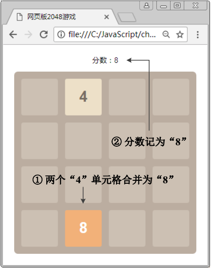

#设置游戏分数

​	在游戏开始后，每次两个相同数字进行合并时，要同时更新棋盘区域上方的分数，分数计算方式为合并后的值进行累加。由于 board 对象的 onMove()方法会在单元格移动后自动调用，在 Game2048 函数中，可以自定义 onMove()方法，通过判断其参数来确定是否发生了合并操作，具体代码如下。

```javascript
var score = 0;	// 通过变量保存分数
board.onMove = function(e) {			
	if (e.to.num > e.from.num) {	
		score += e.to.num;	// 累加分数
		view.updateScore(score);	// 更新页面中显示的分数
	}		
	……（原有代码）	
};		
```

​	在上述代码中，第 3 行用于判断 e.to.num（合并后数字）和 e.from.num（被移动数字）的大小，如果 e.to.num 大于 e.from.num，说明发生了合并操作，将合并后的数字累加到分数中即可。

​	在 View 构造函数中编写如下代码，获取显示分数的元素对象，并将其保存到 this.score 中。

```javascript
this.score = $('#' + prefix + '_score');
```

​	然后在 View 原型对象中增加 updateSocre()方法，更新页面显示的分数。

```javascript
updateScore: function(score) {
	this.score.text(score);
},
```

​	通过浏览器访问测试，当发生合并时，观察分数的变化，如图所示。

​
